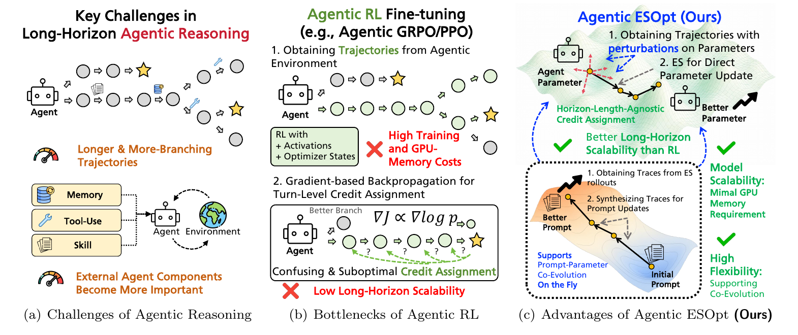
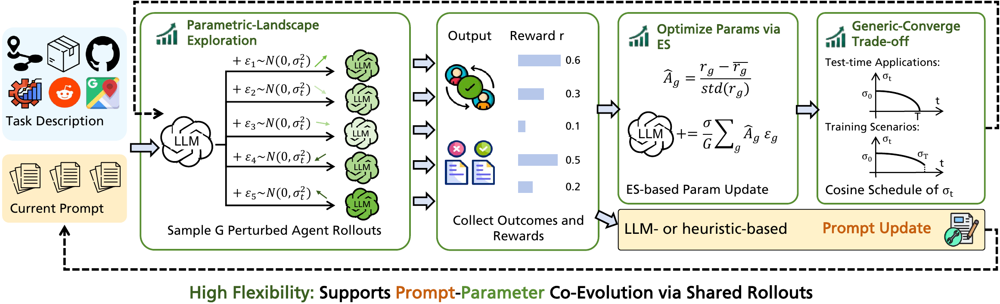

<h1 align="center">
  <a href="https://zz1358m.github.io/Project-Agentic-ESOpt/">
    
  </a>
</h1>

<p align="center"><strong>以最小 GPU 显存微调长程大语言模型智能体</strong></p>

<p align="center">
  <a href="README.md">English</a> ·
  <a href="https://zz1358m.github.io/Project-Agentic-ESOpt/">项目网页</a> ·
  <a href="https://huggingface.co/papers/2608.17310">论文</a> ·
  <a href="https://github.com/zz1358m/Agentic-ESOpt">代码</a> ·
  <a href="https://huggingface.co/collections/zz1358m/agentic-esopt-checkpoints-collection">模型权重</a>
</p>

Agentic-ESOpt 是一个面向长程 LLM 智能体的全参数、无反向传播微调框架。
它使用进化策略（ES）在当前模型附近采样参数扰动，根据智能体在环境中的
标量奖励评估扰动模型，再执行在线的奖励加权更新。整个更新过程只进行前向
计算，GPU 显存需求与模型推理相当。

本仓库包含共享优化器、任务运行脚本、对比基线、Trace2Skill 流程、已发布
模型权重，以及五类智能体任务中保留的实验日志。所有维护中的
Agentic-ESOpt 入口都使用带随机种子、可重放的扰动，因此可以在新启动的
模型服务上重新应用完整优化历史。

## 为什么使用 Agentic-ESOpt？💡



*图 1：长程智能体推理会产生更长、分支更多的轨迹，并使外部记忆、工具和
技能愈发重要。Agentic RL 不仅训练显存开销较大，还需要跨越多个交互轮次
分配信用。Agentic-ESOpt 改用轨迹级黑盒反馈，从而以较低显存完成全参数优化，
并支持 prompt 与参数协同演化。*

Agentic-ESOpt 主要围绕以下三个特性设计：

- **模型可扩展性：** ES 不需要保存用于反向传播的激活值和优化器状态，
  因而能以推理级 GPU 显存执行全参数更新。
- **优化灵活性：** 标量奖励接口可以直接与技能演化和测试时搜索组合，
  包括 Trace2Skill 和 EoH。
- **长程可扩展性：** 每条完整轨迹归因于一个一致的参数扰动，无需把终局
  奖励逐轮分解。

### 主要结果

| 场景 | 论文报告的主要结果 |
| --- | --- |
| 长程 Sudoku | 在 Qwen3.5-4B 的 15-turn 设置中，Agentic-ESOpt 比最强的同等计算量 GRPO 基线高 12.50 个百分点。 |
| Math 与 DocVQA | Agentic-ESOpt 平均比 Qwen3.5-4B 基础模型高 13.7 个百分点，比 Agentic GRPO 高 8.3 个百分点。 |
| WebArena-Lite | Qwen3.5-27B 在不使用 skill 时从 29.47% 提升到 36.16%；与 Trace2Skill 结合后从 33.94% 提升到 36.36%。 |
| 自动启发式设计 | 在测试时计算实验中，Agentic-ESOpt 在 36 组对比中的 28 组优于对应基线。 |

## 工作原理 ⚙️



*图 2：Agentic-ESOpt 采样一组扰动模型，评估它们产生的完整智能体轨迹，
对标量奖励进行归一化，再执行奖励加权的 ES 更新。扰动尺度由余弦调度控制；
同一批轨迹还可以用于基于 LLM 或启发式方法的 prompt 更新。*

在每一代优化中，Agentic-ESOpt 会：

1. 在当前 LLM 附近采样 `G` 个由随机种子确定的参数扰动；
2. 让扰动后的智能体在任务环境中运行并收集轨迹级标量奖励；
3. 在当前种群内归一化奖励，并执行奖励加权的 ES 参数更新；
4. 通过余弦调度衰减扰动尺度，并把种子、奖励、调度和更新写入
   `history.json`。

## 包含内容 🧭

| 任务 | 维护中的流程 |
| --- | --- |
| Sudoku | Agentic-ESOpt、多轮 GRPO |
| Math | Agentic-ESOpt、多轮 GRPO、Trace2Skill、Trace2Skill + Agentic-ESOpt |
| DocVQA | Agentic-ESOpt、多轮 GRPO、Trace2Skill、Trace2Skill + Agentic-ESOpt |
| WebArena | Agentic-ESOpt、Trace2Skill、Trace2Skill + Agentic-ESOpt |
| AHD | EoH、独立采样及其 Agentic-ESOpt 版本 |

共享实现位于 [`algorithms/es/`](algorithms/es/)。

## 已发布 Checkpoint 🤗

各任务的 Agentic-ESOpt 模型权重统一收录在
[Agentic-ESOpt Checkpoints Collection](https://huggingface.co/collections/zz1358m/agentic-esopt-checkpoints-collection)：

| 任务 | Checkpoint |
| --- | --- |
| Math | [`zz1358m/Qwen3.5-4B-MATH-ReAct-Agentic-ESOpt`](https://huggingface.co/zz1358m/Qwen3.5-4B-MATH-ReAct-Agentic-ESOpt) |
| DocVQA | [`zz1358m/Qwen3.5-4B-DocVQA-ReAct-Agentic-ESOpt`](https://huggingface.co/zz1358m/Qwen3.5-4B-DocVQA-ReAct-Agentic-ESOpt) |
| WebArena | [`zz1358m/Qwen3.5-27B-WebArena-Agentic-ESOpt`](https://huggingface.co/zz1358m/Qwen3.5-27B-WebArena-Agentic-ESOpt) |
| Sudoku Mask15 | [`zz1358m/Qwen3.5-4B-Sudoku-Mask15-Agentic-ESOpt`](https://huggingface.co/zz1358m/Qwen3.5-4B-Sudoku-Mask15-Agentic-ESOpt) |

可以把模型仓库 ID 直接传给兼容的 Transformers/vLLM 入口，也可以先下载到
本地再启动服务：

```bash
hf download zz1358m/Qwen3.5-4B-MATH-ReAct-Agentic-ESOpt \
  --local-dir checkpoints/math-agentic-esopt
```

后续在任务说明要求填写 `MODEL_PATH` 或 `MODEL` 的地方使用该仓库 ID 或本地
目录即可；对应的评测日志、skill 和精确启动参数仍保留在本仓库各任务目录中。

## 仓库结构 📦

```text
algorithms/                 优化算法与训练集成
  es/                       Agentic-ESOpt 共享实现
  trace2skill-settings/     prompt、配置、脚本和 skill
  verl/                     GRPO 使用的内置 VERL 源码
  verl_trace2skill/         多轮工具、解析器、奖励和测试
scripts/                    用户入口脚本和数据检查
sudoku-train-time/          Sudoku 环境、运行脚本和日志
math-train-time/            Math 环境、运行脚本和日志
docvqa-train-time/          DocVQA 环境、运行脚本和日志
webarena-train-time/        WebArena 环境、集成和日志
ahd-test-time/              EoH/AHD 运行时、评测器和程序
data/                       稳定的数据约定和小型源数据
```

简要入口映射见 [`PROJECT_LAYOUT.md`](PROJECT_LAYOUT.md)，每个维护中运行入口的
实际默认超参数见 [`scripts/RUN_HYPERPARAMETERS.md`](scripts/RUN_HYPERPARAMETERS.md)。

## 环境要求 🧰

- 训练和模型服务需要 Linux 与 NVIDIA GPU。
- Python `>=3.10`，推荐 Python 3.10 或 3.11。
- CUDA 12.x，以及与 CUDA 匹配的 PyTorch。
- DocVQA 的 bash/OCR 环境需要 `bubblewrap` 和 `tesseract-ocr`。
- 本仓库不提交本地模型权重和完整任务数据集。

下面是已经验证可运行的版本组合，并非唯一支持的版本：

| 流程 | Python | PyTorch | Transformers | vLLM / VERL |
| --- | --- | --- | --- | --- |
| Qwen3.5 Agentic-ESOpt 与评测 | 3.10 | 2.10.0 | 4.57.6 | vLLM 0.19.1 |
| 多轮 GRPO | 3.11 | 2.6.0 | 4.51.1 | 仓库内置 VERL |
| CPU 测试与 AHD 工具 | >=3.10 | 可选 | 兼容的近期版本 | 不需要 |

建议为 Qwen3.5 推理和 GRPO 分别建立环境：内置 VERL 与新版 Qwen3.5 vLLM
的依赖约束不同。先安装与本机 CUDA 匹配的 PyTorch，再安装其余依赖。

```bash
# Agentic-ESOpt / 评测环境
python3.10 -m venv .venv-es
source .venv-es/bin/activate
python -m pip install --upgrade pip
python -m pip install transformers==4.57.6 vllm==0.19.1 \
  accelerate datasets pillow pandas pyarrow math-verify openai tiktoken
python -m pip install -e 'ahd-test-time/methods/eoh/original/eoh[all]'

# GRPO 环境（另建并激活一个 Python 3.11 环境）
python -m pip install torch==2.6.0 transformers==4.51.1
python -m pip install -e ./algorithms/verl
```

CUDA 对应的 VERL 镜像及可选后端见
[`algorithms/verl/docker/`](algorithms/verl/docker/) 和
[`algorithms/verl/README.md`](algorithms/verl/README.md)。

## 快速开始 ⚡

```bash
git clone https://github.com/zz1358m/Agentic-ESOpt.git
cd Agentic-ESOpt
cp scripts/settings.example.env scripts/settings.local.env
```

在 `scripts/settings.local.env` 中填写模型路径、GPU、端口和服务地址。按照
[`data/README.md`](data/README.md) 准备数据，并在启动实验前检查数据约定：

```bash
python scripts/check_data.py
python scripts/check_data.py --task math --strict
```

生成的 checkpoint 和普通运行目录默认不会进入 git。每次实验请使用唯一的
`RUN_ID`，并随运行目录保存完整命令和本机配置。

## 复现实验流程 🧪

### Sudoku

缺少默认 controlled-mask 数据时，ES 入口会自动生成。两个入口都会读取
`scripts/settings.local.env`。

```bash
SUDOKU_TARGET_MASK_COUNT=15 RUN_ID=sudoku_es_m15 \
  scripts/sudoku/run_es.sh

SUDOKU_TARGET_MASK_COUNT=15 SUDOKU_GRPO_MODEL=/path/to/Qwen3.5-4B \
  scripts/sudoku/run_grpo.sh

SUDOKU_TARGET_MASK_COUNT=15 SUDOKU_GRPO_MODEL=/path/to/Qwen3.5-4B \
  scripts/sudoku/run_grpo_t1.sh
```

`run_grpo.sh` 的 rollout 使用 temperature 0.7、top-p 0.8、top-k 20；
`run_grpo_t1.sh` 的 rollout 使用 temperature 1、top-p 1、top-k -1。两套 eval
都固定使用 temperature 0.7、top-p 0.8、top-k 20。完整 ES/GRPO 超参数见
[`sudoku-train-time/README.md`](sudoku-train-time/README.md)。

### Math 与 DocVQA

两个任务使用相同的四阶段标准流程：

```bash
scripts/es_skill_workflow.sh math es-train
scripts/es_skill_workflow.sh math eval
scripts/es_skill_workflow.sh math distill-skill
scripts/es_skill_workflow.sh math skill-eval

# DocVQA 流程把 math 替换为 docvqa。
```

两个任务的 trajectory 蒸馏策略不同。Math 扫描全部 ES generation 的所有
candidate trajectory，每道训练题最多保留一条 `FAILED`，所有成功轨迹均排除。
默认 25 generations × 每代 16 题正好覆盖 400 道训练题，因此最多输入 400 条
轨迹。DocVQA 只取 checkpoint 前精确的最后 50 个 task occurrence，并对每题
最多各保留一条 `FAILED` 和一条 `SUCCEED`。若某类轨迹不存在，会记录到
selection manifest；`skill-eval` 会重放同一份 Agentic-ESOpt history 后评测
蒸馏得到的 skill。本文所有 Trace2Skill 分析和 skill evolution 都使用
`gpt-5.4-nano`。

在 `scripts/settings.local.env` 中设置 `MODEL_PATH`、`TRAIN_RUN_ID`、数据路径和
GPU 参数。完整变量见
[`scripts/README_ES_SKILL_WORKFLOW.md`](scripts/README_ES_SKILL_WORKFLOW.md)。

React-VERL 封装脚本提供合并后的 GRPO 训练和四副本评测入口：

```bash
scripts/math/run_react_verl_grpo.sh train
MATH_GRPO_EVAL_MODEL_PATH=/path/to/hf_checkpoint \
  scripts/math/run_react_verl_grpo.sh eval

scripts/docvqa/run_react_verl_grpo.sh train
DOCVQA_GRPO_EVAL_MODEL_PATH=/path/to/hf_checkpoint \
  scripts/docvqa/run_react_verl_grpo.sh eval
```

训练 checkpoint、原始 trajectory、验证 trajectory 和日志统一写入
`runs/multiturn_grpo/`。Math 评测默认使用四样本
`repo-react-v1-50x4096` profile。通过 `*_PHYSICAL_GPU_IDS`、`*_EVAL_OUT`
和 `*_EVAL_SAMPLES` 可以适配其他服务器布局。

若要运行固定 DAPO-400 Math 守护流程，并依次续跑初始评测、训练、训练后评测、
trajectory 导出和报告，可执行：

```bash
python scripts/math/run_experiment_until_complete.py
```

### WebArena

先准备配置好的训练集和 held-out 评测集：

```bash
python webarena-train-time/scripts/prepare_webarena_nonlite_split.py
python webarena-train-time/scripts/prepare_vab_webarena_lite_split.py
```

正式划分会从原始 812 个 WebArena 任务中排除 165 个 Lite 配置记录的
`old_task_id`，再以 seed `20260605` 得到 582 个训练任务和 65 个验证任务。
Lite 的 `task_id=0–164` 是新的评测编号，并不是需要从原始数据中直接排除的
ID。精确哈希和完整划分规则见
[`webarena-train-time/README.md`](webarena-train-time/README.md)。

WebArena 有两条独立的 trajectory → skill 路径：No-Finetune 使用基座模型
rollout，只演化 skill；Agentic-ESOpt 则从已完成的 NoSkill ES run 蒸馏另一份
skill：

```bash
scripts/webarena/run.sh trace2skill_no-finetune distill

RUN_ID=webarena_noskill_es \
scripts/webarena/run.sh noskill_agentic_esopt train

WEBARENA_TRAJECTORY_RUN=runs/webrl_lite_full_es/webarena_noskill_es \
scripts/webarena/run.sh trace2skill_agentic_esopt distill
```

Agentic-ESOpt 路径的蒸馏使用所有已完成 ES generation 中的全部 trajectory，
不只取最后若干代，也不设置 trajectory 数量上限；两条路径的分析和 skill
evolution 都使用 `gpt-5.4-nano`。

Trace2Skill-Agentic-ESOpt 蒸馏完成后，只重放已经训练好的 NoSkill ES
history，并在最终评测时注入从 ES trajectories 蒸馏的 skill；不会再启动
第二轮 ES，也不会在蒸馏后继续更新模型权重。

同一入口可评测 NoSkill/Trace2Skill × No-Finetune/Agentic-ESOpt 四种设置。完整命令、
默认超参数、外部代码和服务配置见 [`data/README.md`](data/README.md) 与
[`webarena-train-time/README.md`](webarena-train-time/README.md)。

### AHD

安装 EoH 运行时、启动模型服务，然后运行单个任务：

```bash
MODEL=/path/to/Llama-3.1-8B-Instruct \
  scripts/ahd/start_llama31_8b_servers.sh

bash scripts/ahd/run_ahd_1000.sh eoh
bash scripts/ahd/run_ahd_1000.sh agentic-esopt-eoh

bash scripts/ahd/run_ahd_2000.sh eoh
bash scripts/ahd/run_ahd_2000.sh agentic-esopt-eoh
```

六个任务、采样流程、预算和续跑参数见
[`ahd-test-time/README.md`](ahd-test-time/README.md)。

## 续跑与输出 ♻️

Agentic-ESOpt 会原子写入 `history.json`。使用相应的 `*_RESUME_HISTORY`
环境变量，可以在继续训练前重放已经完成的更新。例如：

```bash
SUDOKU_ES_RESUME_HISTORY=/path/to/history.json \
RUN_ID=sudoku_resumed scripts/sudoku/run_es.sh
```

新运行写入 `runs/` 或 `cache/active_runs/`。筛选保留的日志和评测文件位于各任务
的 `*-train-time/results/`。这些目录只保存实验依据，不重复维护结果汇总表；
核对结果时请同时查看任务 README 与原始日志。

## 检查 ✅

下面的快速检查不需要启动模型服务：

```bash
python -m unittest algorithms.es.test_run_state -v
python -m unittest algorithms.es.test_seeded_model_es -v
python -m unittest discover math-train-time/tests -v
python -m unittest discover docvqa-train-time/tests -v
python -m unittest algorithms.verl_trace2skill.test_reward -v
python scripts/check_data.py
```

## 许可证

见 [`LICENSE`](LICENSE)。
